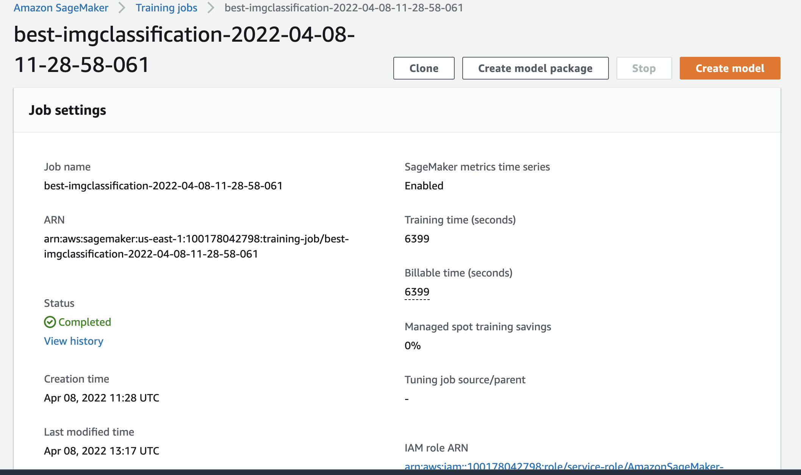
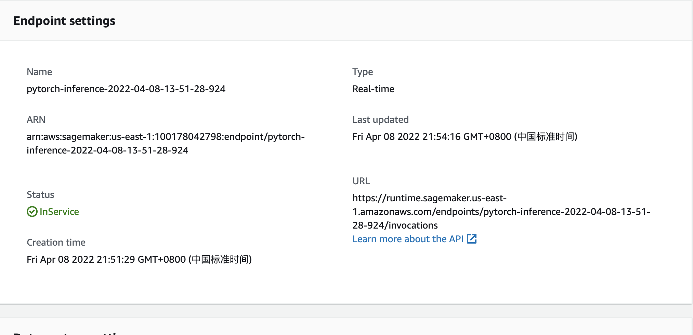

# Image Classification using AWS SageMaker

This is a Deep learning project done as part of Udacity's **AWS Machine Learning Engineer Nanodegree Program**. Here I used AWS Sagemaker to train a pretrained model **resnet50** that can perform image classification. 
First hyperparameter tuning is performed on a range of parameters then the best hyperparameters have been extracted to create and fine tune the new model. SageMaker's debugger and profiler have been used to debug/observe the training process and analyse the resource utilization of the model.

## Project Set Up and Installation
Enter AWS through the gateway in the course and open SageMaker Studio.
Download/clone the project files.  Download/Make the dataset available. 

### Project file structure
__train_and_deploy.ipynb :__ This jupter notebook document contains the main project code. Downloads the dataset and uploads the data to the S3 bucket specified.

__hpo.py :__ Training script for hyperparameter tuning. Takes the hyperparameters as argument.

**train_model.py :** Training script with debugger and profiler hooks. Used for creating the fine tuned model with the best performed hyperparameters.

__inference.py :__ Script used for deploying the model.

## Dataset
Dog breed classication data set has been used in for this image classification project and is available [here](https://s3-us-west-1.amazonaws.com/udacity-aind/dog-project/dogImages.zip). The dataset comprised of images of 133 dog breeds.

## Hyperparameter Tuning
Here I used the 'resnet50' pretrained model for this experiment, because as a starter project for transfer learning this is a good choice.

The hyperparameters and the ranges used are; 
```
learning-rate: ContinuousParameter(0.001, 0.1)
batch-size:    CategoricalParameter([32, 64, 128, 256, 512])
epochs:        IntegerParameter(2,10)
test-batch-size: 100
```
**Screenshot of Hyperparameter tuning job**

    
__The best hyperparameters from all the training jobs are;__
```
  'test-batch-size': 100,
  'epochs': 8,
  'batch-size': 256,
  'lr': 0.01601964735334812
```

## Debugging and Profiling

__Summary from logs:__

```
VanishingGradient: Error
Overfit: Error
Overtraining: IssuesFound
PoorWeightInitialization: IssuesFound
LossNotDecreasing: InProgress
```

### Results
There were no issues in the debugger report.
In the profiler report there were issues with low gpu utilization.
This could be due to the powerful instance type I used, 'ml.g4dn.2xlarge'.
Where as the memory is concerned I don't see any issue, it looks ok.


## Model Deployment
The model has been deployed using the PyTorchModel. For this I used a separate script 'inference.py'. When I used the training script it gave error for smdebug model. So, instead of modifying the training script, a separate script has been used.

The endpoint can be queried using the code in the notebook. The url of the test image needs to used to fetch the image. Then preprocess the image and pass it to endpoint for prediction.

**Screenshot of the endpoint SageMaker**


## Querying the model endpoint
The endpoint can be queried using the predict() method of the predictor that was deployed.
Test image needs to be passed as below;

```
response = predictor.predict(img_bytes, initial_args={"ContentType": "image/jpeg"})
```
